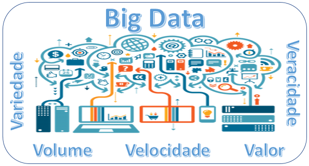
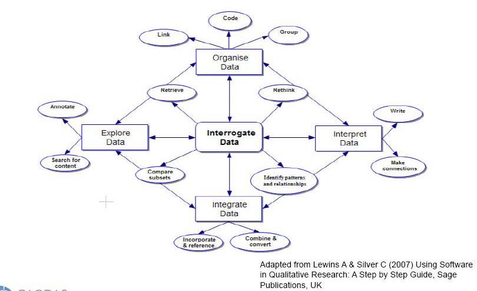
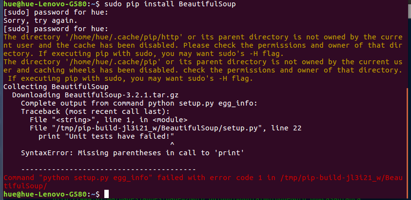

layout: true

---
class: middle, center
```{r setup, include=FALSE}
options(htmltools.dir.version = FALSE)

knitr::opts_chunk$set(
	echo = FALSE,
	fig.align = "center",
	message = FALSE,
	warning = FALSE,
	cache = FALSE
)
```

```{r eval=FALSE, include=FALSE}
library(knitr)
library(tidyverse)
library(widgetframe)
```

# Leonardo F. Nascimento

```{r out.width="25%"}
knitr::include_graphics("img/logos_bia.png")
```
15% Programador, 20% Químico, 25% Psicólogo, 40% Cientista Social

[Email: **leofn@ufba.br**](mailto:leofn@ufba.br) 

[Twitter:**@leofn3**](http://www.twitter.com/leofn3) 

[website: **www.leofn.com**](http://www.leofn.com)

---

class: middle, center  

```{r, out.width="50%"}
knitr::include_graphics("img/logo_MA_color.png")
```

# LABHDUFBA nas redes:


Twitter: [@labhdufba](https://twitter.com/labhdufba), 
  
  
Instagram: [@labhdufba](http://instagram.com/labhdufba)
  
  
Github: [https://github.com/LABHDUFBA](https://github.com/LABHDUFBA)
  
  
Youtube: [Clique aqui](https://www.youtube.com/channel/UCjUf9BsbG-C-gpA54zvOgBw)

---
class: inverse, center, middle

# Digital Turn - Virada Digital

---
class: middle, center

## "Digitalização do eu na vida cotidiana" 

```{r, out.width="80%"}

```
---
class: middle, center

## Algoritmização de processos sociais

```{r, out.width="60%"}
knitr::include_graphics("img/matrix-digital-self.png")
```

---
class: middle, center

## Traços digitais (digital data trace)

```{r, out.width="75%"}
knitr::include_graphics("img/socioloy.png")
```

> "registros de atividade realizados por meio de um sistema de informação online (portanto, digital). Um traço é uma marca deixada como sinal de passagem; é uma evidência registrada de que algo ocorreu no passado" (HOWISON et alli, 2011)

---
class: middle, center

## Dataficação

```{r, out.width="75%"}
knitr::include_graphics("img/datafication4.jpg")
```

> "Dataficação refere-se ao processo pelo qual sujeitos, objetos e práticas são transformados em dados digitais" (SOUTHERTON, 2020) 

---
class: inverse, center, middle

# O que é big data?

---
class: middle, center

## Big data

```{r, out.width="90%"}

```

---
class: middle, center

## Big data

```{r, out.width="60%"}
knitr::include_graphics("img/bigdatacat.jpg")
```

> Big data pode ser entendido como "a capacidade de pesquisar, agregar e cruzar grandes conjuntos de dados" (Boyd and Crawford 2012, p. 663)

---
class: inverse, center, middle

# Qual o desafios do uso de big data nas pesquisas em ciências sociais?

```{r, out.width="60%"}
knitr::include_graphics("https://media.giphy.com/media/atZII8NmbPGw0/giphy.gif")
```

---
class: middle, center

# Precisamos deixar de ser noobs!
```{r, out.width="60%"}
knitr::include_graphics("https://media0.giphy.com/media/CjmvTCZf2U3p09Cn0h/giphy-downsized.gif")
```

---
class: middle, center

## Incorporando técnicas de webscraping

```{r, out.width="85%"}
knitr::include_graphics("img/webscraping.png")
```
---
class: middle, center

## Incorporando técnicas de webscraping

```{r, out.width="85%"}
knitr::include_graphics("img/webscraping2.png")
```

---
class: middle, center

## Incorporando linguagens de programação

```{r, out.width="75%"}
knitr::include_graphics("img/linguagens.jpg")
```

---
class: middle, center

## Incorporando aplicativos para análise dos dados 

```{r, out.width="100%"}

```

---
class: middle, center

# Nunca tivemos tantos dados, ferramentas, técnicas... 

```{r, out.width="85%"}
knitr::include_graphics("https://media.giphy.com/media/YnlDGfCxyOIYTDp86I/giphy.gif")
```

---
class: middle, center

# ..mas nossos problemas NÃO acabaram! 

```{r, out.width="85%"}
knitr::include_graphics("https://media.giphy.com/media/H0kxiS2RJF2HC/giphy.gif")
```

---
class: inverse, center, middle

# Três grandes eixos de desafios:

---
class: middle, center

--
## 1. fontes digitais da pesquisa
<br>

--
## 2. métodos e técnicas digitais
<br>

--
## 3. vigilância epistemológica das pesquisas em meios digitais
<br>

---
class: middle, center
# 1. Desafios das fontes da pesquisa
<br>

--
## publicidade/acessibilidade
<br>

--
## evocação versus coleta
<br>

--
## representatividade
<br>

--
## pré-construção	algorítimica dos dados
<br>

--
## capacidade computacional
<br>

---
class: middle, center
# 2. Desafios das técnicas e métodos
<br>

--
## letramento digital dos pesquisadores
<br>

--
## pré-construção	algorítimica das ferramentas ("black-box")
<br>

--
## cuidado com o soterramento! (download *versus* capacidade analítica)


---
class: inverse, center, middle

# 3. Vigilância epistemológica em meios digitais  

---
class: middle, center

# Um "erro no código" passa a constituir um "erro metodológico"

```{r, out.width="100%"}

```

---
class: middle, center

# "nossos ajudantes digitais já estão cheios de teoria e julgamento" (Bernhard Rieder and Theo Röhle in: BERRY, 2012, p. 70)

```{r, out.width="50%"}

```

---
class: middle, center

# “Não existe neutralidade metodológica das técnicas” 
(BOURDIEU; PASSERON; CHAMBOREDON, 2004, p. 55)

```{r, out.width="45%"}
knitr::include_graphics("img/bourdieu.jpg")
```

---
class: middle, center

# À guisa de conclusão: que fazer?
<br>

--
## Investir no letramento digital!
<br>

--
## Praticar ciência aberta: dados abertos, códigos abertos, ferramentas abertas;
<br>

--
## Abandonar o fetichismos dos dados, dos métodos e dos resultados


---
## Referências Bibliográficas

BOURDIEU, P.; PASSERON, J. C.; CHAMBOREDON, J. C. Ofício de Sociólogo: metodologia da pesquisa na sociologia. Petrópolis: Vozes, 2004. 

Boyd, D., & Crawford, K. (2012). Critical questions for big data. Information, Communication & Society, 15(5), 662–679

HOWISON, J.; WIGGINS, A.; CROWSTON, K. Validity Issues in the Use of Social Network Analysis with Digital Trace Data. Journal of the Association for Information Systems, v. 12, n. 12, 29 dez. 2011. Disponível em: <http://aisel.aisnet.org/jais/vol12/iss12/2>.

RIEDER, B.; RÖHLE, T. Digital Methods. In: SCHÄFER, M. T.; VAN ES, K. (Ed.). The Datafied Society. Studying Culture through Data. [s.l.] Amsterdam University Press, 2017. p. 109–124. 

SOUTHERTON, C. Datafication. In: SCHINTLER, L. A.; MCNEELY, C. L. (Ed.). Encyclopedia of Big Data. Cham: Springer International Publishing, 2020. p. 1–4. 
Disponível em: <https://link.springer.com/referenceworkentry/10.1007%2F978-3-319-32001-4_332-1>.

---
class: middle, center

## Obrigado gente!

.pull-left[
```{r, out.width="100%"}
knitr::include_graphics("https://media1.giphy.com/media/3oz8xIsloV7zOmt81G/giphy.gif")
```
]
.pull-right[
##**Agradecimentos especiais**:
### Prof. Dr. Edison Bertoncelo - Pelo convite!
<br>
### Ao público pela paciência!
]

